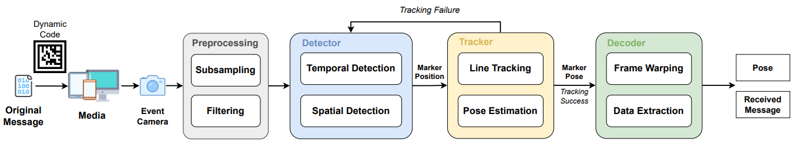

# Motion-Aware Optical Camera Communication with Event Cameras

<p align="center">
    <a href="https://suhang99.github.io/">Hang Su</a> &emsp;&emsp; 
    <a href="https://www.linkedin.com/in/mgaoling/">Ling Gao</a>  &emsp;&emsp;
    <a href="https://www.linkedin.com/in/tao-liu-747327337/">Tao Liu</a> &emsp;&emsp;
    <a href="https://mpl.sist.shanghaitech.edu.cn/Director.html">Laurent Kneip</a> &emsp;&emsp;
</p>

<p align="center">
    <sup></sup>Mobile Perception Lab,
    <sup></sup>ShanghaiTech University
</p>

<p align="center">
    <a href="https://github.com/suhang99/EventOCC"><strong>Code</strong></a> |
    <a href="https://arxiv.org/pdf/2412.00816"><strong>arXiv</strong></a> |
    <a href="https://drive.google.com/file/d/1BW0kNI5JXVr535Ei5K5R-rVW_kXT2v6q/view?usp=sharing"><strong>Video</strong></a> | 
    <a href="https://drive.google.com/file/d/1AN-MyGDBzKnodQiOJwfY-3UyuNw-aiyB/view?usp=sharing"><strong>Test Data</strong></a>
</p>

The open-source implementation of "Motion-Aware Optical Camera Communication with Event Cameras".

<p align="center">
    
</p>

## Marker Generation
We have provided Python scripts to generate our dynamic markers.
### Dependencies
- OpenCV
- Numpy
- click
- alive_progress
- termcolor

### Example usage
```bash
python marker_generation/marker_generator.py [data.txt] --output_path [marker.mp4] --cell 16 --fps 60 --duration 30 
```
Please replace **[data.txt]** and **[marker.mp4]** with your input and output path.

Note that in our experiment for camera motion, we set the cell number to 16.

## Event-based OCC

The example data is available at [Google Drive](https://drive.google.com/file/d/1AN-MyGDBzKnodQiOJwfY-3UyuNw-aiyB/view?usp=sharing). The example data contain a rosbag, GT trajectory and the raw message to transmit.

### Dependencies 
The code has been tested on Ubuntu 20.04 with ROS noetic and the following dependencies:
- Eigen3 3.3.7
- OpenCV 4.2
- Ceres 2.2

### Usage

Enter an existing catkin workspace
``` bash
cd {your_catkin_workspace}/src/
```
or create a catkin workspcae if you don't have one
``` bash
mkdir -p ros_ws/src && cd ros_ws/src
```
Clone this repository from Github
``` bash
git clone git@github.com:suhang99/EventOCC.git
```
Build the catkin package by
``` bash
source /opt/ros/noetic/setup.bash
catkin build evlc_screen
```
Make sure you have correctly set the parameters in *launch/run.launch* and *param/default.yaml*, and run
``` bash
source {your_catkin_workspace}/devel/setup.bash
roslaunch evlc_screen run.launch
```
The output trajectory is in TUM format (timestamp tx ty tz qx qy qz qw).

## Acknowledgements

We would like to acknowledge the funding support provided by project 62250610225 by the Natural Science Foundation of China, as well as projects 22DZ1201900, 22ZR1441300, and dfycbj-1 by the Natural Science Foundation of Shanghai.